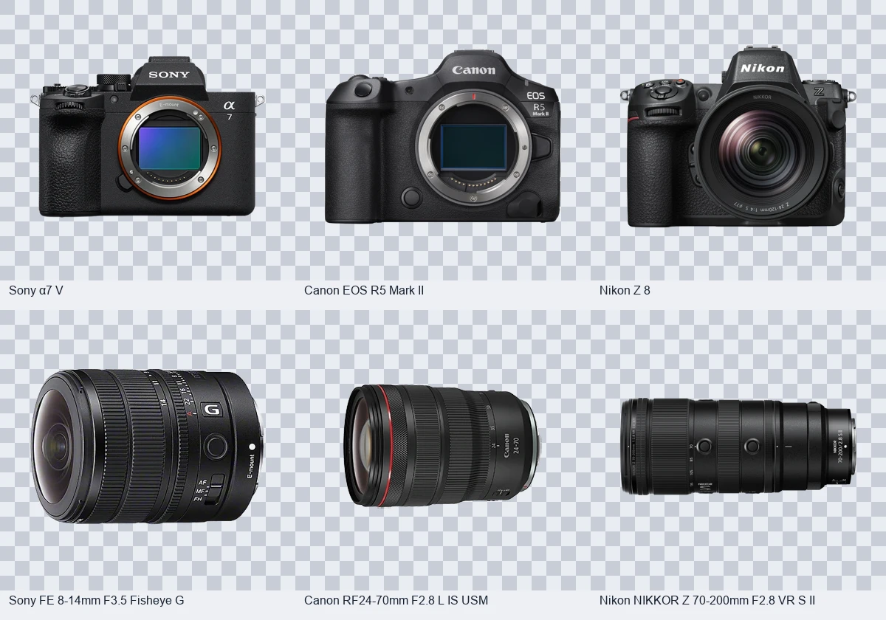

# Matchcamera 제품 데이터 정리 · 2026-09-11

로컬 저장소 `D:\Matchcamera`, 작업 브랜치 `codex/catalog-refresh-20260911`에 반영했다. 운영 사이트 배포와 Git 원격 푸시는 수행하지 않았다.

## 반영 내용

- DSLR/DSLT 바디와 DSLR 마운트 렌즈 **277개**를 `active: false`로 설정했다. 데이터는 보존했다. Canon EF-M, Micro Four Thirds와 EF 마운트 시네마 바디는 유지했다.
- Sony·Canon·Nikon의 활성 제품 **330개 항목**에 정확한 모델의 공식 사진을 연결했다. 330개 중 Canon C400/C80은 원본 DB와 확장 DB에 각각 등록되어 있다.
- 공식 원본 **313개**는 긴 변 500px 이상이다. 나머지 **17개**는 공식 사이트의 작은 원본을 확대하지 않고 사용하며 이미지 정보에 `lowResolution`을 기록했다.
- 투명 원본은 알파 채널을 유지했다. 나머지는 승인받은 로컬 `rembg` 프로그램으로 처리했다. 검수에서 제품 일부가 반투명해진 10개는 흰색 배경 경계만 제거하도록 보정하고, FX6의 제품과 떨어진 배지는 제거했다.
- 빈 여백을 정리하고 투명 여백을 통일했다. 웹 표시용 WebP는 최대 960px이며, 다운로드한 원본은 별도로 보존했다.
- 검색 위 “제품명, 모델 코드, Sony α 약칭까지 통합 검색합니다.” 문장을 삭제했다.
- 어드민 제품 관리의 **활성화 / 비활성화** 버튼을 정리했다. 이전 `enabled`/`visibility` 값 때문에 재활성화가 무효가 되던 문제와 중복 제품의 다른 등록 항목이 숨김 설정을 덮어쓰던 문제를 수정했다. 변경은 기존 방식대로 대기 변경사항에 저장되며, 어드민의 배포 기능으로 공개 사이트에 반영된다.

## 한국 가격

| 제조사 | 공식 가격 재확인 |
|---|---:|
| Sony | 72 |
| Canon | 72 |
| Nikon | 56 |
| 합계 | **200** |

기존 금액 104개를 재확인했고, 비어 있던 가격 96개를 보완했다. 단품과 키트를 구분했으며 쿠폰·즉시할인·행사 가격을 정상가로 입력하지 않았다. Nikon은 공식몰 브라우저의 제품 상세 페이지에서 정상가와 할인율을 확인했다. 별도 할인이 없는 현재 표시가는 `한국 공식 현재 판매가`로 구분했다.

가격표 전체 506개 기존 항목 중 나머지 **306개**는 이번에 공식 금액을 재확정하지 못했다. 이 중 현재 활성 제품에 대응하는 가격표 항목은 142개다. 이전 금액과 확인일 또는 미확인 상태를 유지했으며, 재확인한 것으로 표시하지 않았다. 단종 제품의 출시가를 해외 가격 환산이나 키트 차액으로 추정하지 않았다.

상세 출처, 이전 값, 확인 금액과 미확인 목록: [가격 검수 기록](korea-price-refresh-20260911.json).

## 소니 신제품

[FE 8–14mm F3.5 Fisheye G / SEL814G](https://www.sony.co.kr/electronics/e-mount-lenses/sel814g)를 추가했다. Sony E 풀프레임 어안 줌, 고정 F3.5, 314g, 최소 촬영거리 0.15m이다. 발표일은 2026-09-08이다.

한국 공식 페이지가 “곧 공개” 상태이므로 한국 출시일과 가격은 미발표로 두었다. 발표일을 국내 판매 시작일로 입력하지 않았다.

이미지 모델 대조 중 발견한 Nikon 1 10–100mm 두 렌즈의 조리개 표기 혼동도 공식 사양에 맞게 수정했다. 기존 제품 ID는 유지했다. [수정 근거](nikon-model-corrections-20260911.json).

## 검증 및 재사용

- 공개 목록과 경량 인덱스에서 비활성 제품 제외, EF-M 및 시네마 유지, SEL814G 표시 확인.
- 어드민 버튼 및 편집창의 재활성화, 레거시 숨김 값 해제, 중복 등록 동기화 테스트 통과.
- Worker 관리자 API 통합 검사, 프로그램 검사, 홈페이지 검사, JavaScript 문법 검사 통과.
- 사진 330개 연결, 로컬 경로, 불투명 제품 픽셀과 투명 배경, 최대 크기 검증.

처리 스크립트: `scripts/process_official_cutouts.py`, `scripts/import_verified_cutouts.py`.
검수 보정값: [이미지 보정 설정](image-cutout-overrides-20260911.json).
이미지별 공식 출처·모델 대조 근거: [이미지 검수 기록](official-image-refresh-20260911.json).

원본 및 작업 전 백업은 `C:\Users\Caffa\Documents\ChatGPT\matchcamera` 아래 `asset-research-20260911`, `cutouts-20260911`, `backups` 폴더에 보관했다.

## AdSense

신청할 수 있다. 실제 승인은 Google의 사이트 심사에 달려 있다. 등록 전 개인정보처리방침에 Google 광고와 쿠키 사용을 설명하고, 제품 비교 설명이나 사용 가이드처럼 방문자에게 도움이 되는 직접 작성한 콘텐츠를 보완하는 것이 좋다. 가입이나 광고 코드는 이번 변경에 포함하지 않았다.

근거: [AdSense 자격 요건](https://support.google.com/adsense/answer/9724?hl=ko), [필수 개인정보처리방침 내용](https://support.google.com/adsense/answer/1348695?hl=ko).

